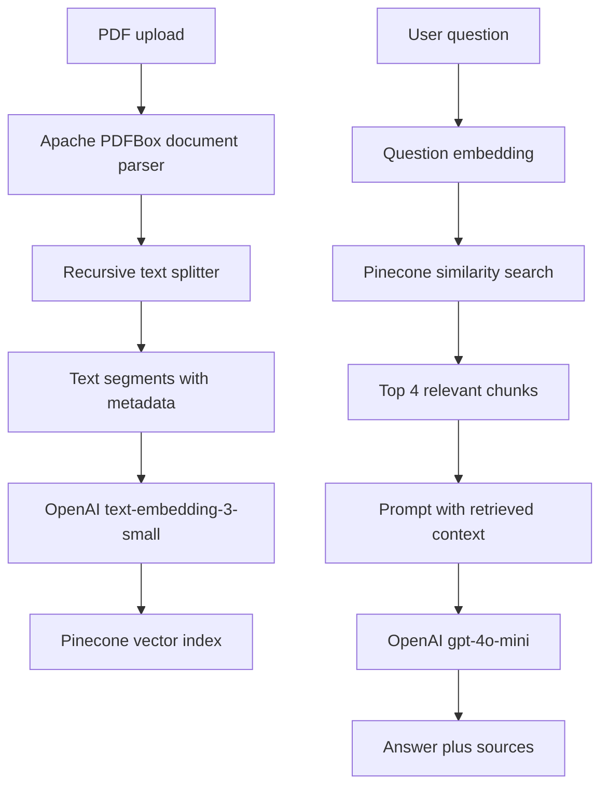

# Document Q&A RAG using LangChain4j and Pinecone

A beginner-friendly Simple RAG application built with Java 17, Spring Boot 3.5.6, LangChain4j 1.20.2 core APIs, the matching LangChain4j 1.20.2-beta30 Pinecone/PDF integration modules, OpenAI, and Pinecone. Upload a PDF, then ask questions that are answered from retrieved PDF text.

## Architecture



The code intentionally implements Simple RAG: one question embedding, one vector search, top-K results, one prompt, and one LLM call. It does not include query rewriting, multi-query retrieval, hybrid search, reranking, agents, or memory.

## Project structure

```text
src/main/java/com/example/rag/
├── controller/
│   ├── DocumentController.java
│   └── RagController.java
├── service/
│   ├── DocumentService.java
│   └── RagService.java
├── config/
│   └── AiConfig.java
├── model/
│   ├── AskRequest.java
│   └── AskResponse.java
└── exception/
    ├── GlobalExceptionHandler.java
    └── RagException.java
```

## Prerequisites

1. Install a Java 17 or newer JDK and confirm it:

   ```powershell
   java -version
   ```

2. Install Apache Maven 3.9 or newer and confirm it:

   ```powershell
   mvn -version
   ```

3. Create an OpenAI API key.
4. Create a Pinecone account and API key.

## Create the Pinecone index

This project uses OpenAI `text-embedding-3-small`. LangChain4j reports its known dimension as **1536**, and `application.properties` configures the same value. Create a serverless Pinecone index with:

- Index name: any name you choose, used as `PINECONE_INDEX_NAME`
- Dimensions: `1536`
- Metric: `cosine`
- Cloud: `AWS`
- Region: `us-east-1` (or change `rag.pinecone.region` to the region you select)

The application also passes the same serverless configuration to `PineconeEmbeddingStore`; it creates the index automatically if the named index does not already exist. Never use a different dimension with this embedding model. If you change the embedding model, use that model's documented dimension and update `rag.openai.embedding-dimension` and the Pinecone index together.

## Configure environment variables

PowerShell for the current terminal:

```powershell
$env:OPENAI_API_KEY = "your-openai-key"
$env:PINECONE_API_KEY = "your-pinecone-key"
$env:PINECONE_INDEX_NAME = "your-index-name"
```

Windows user-level variables can also be configured with `setx`, then a new terminal must be opened:

```powershell
setx OPENAI_API_KEY "your-openai-key"
setx PINECONE_API_KEY "your-pinecone-key"
setx PINECONE_INDEX_NAME "your-index-name"
```

Keys are read with `System.getenv` in `AiConfig` and are not hardcoded in source or properties.

## Run

From the project root:

```powershell
mvn spring-boot:run
```

The server listens on `http://localhost:8080`.

## Test with Postman

### Upload a PDF

- Method: `POST`
- URL: `http://localhost:8080/api/documents/upload`
- Body: `form-data`
- Add a field named `file`, choose type `File`, and select a PDF.

Example response:

```json
{
  "document": "spring-boot.pdf",
  "chunksStored": 12
}
```

### Ask a question

- Method: `POST`
- URL: `http://localhost:8080/api/rag/ask`
- Header: `Content-Type: application/json`
- Body:

```json
{
  "question": "What is Spring Boot?"
}
```

Example response:

```json
{
  "answer": "Spring Boot is a framework for building Java applications.",
  "sources": [
    {
      "document": "spring-boot.pdf",
      "page": null
    }
  ]
}
```

The PDFBox parser used here preserves document metadata, including any page metadata supplied by the parser. The basic parser returns one text document for a PDF, so `page` is `null` unless page metadata is available. The filename is always preserved.

## Why chunking and overlap?

An entire PDF is usually too large and too broad to send to an LLM for every question. Chunking creates smaller searchable units, so Pinecone can return only the passages likely to answer the question. This project uses 800-character chunks with 120 characters of overlap. The overlap repeats a small boundary between neighboring chunks so a definition or sentence split at a boundary remains retrievable. Chunk size and overlap are practical starting points, not universal rules.

##  RAG

- **RAG:** Retrieve relevant private or current text and place it in an LLM prompt before generating an answer.
- **Embedding:** A vector of numbers representing the meaning of text. Similar meanings tend to have nearby vectors.
- **Vector database:** A database optimized for storing vectors and searching for nearby vectors.
- **Pinecone:** A hosted vector database used here to store embedded text segments and search them.
- **Chunking:** Splitting a large document into smaller text segments for better retrieval and smaller prompts.
- **Similarity search:** Comparing the question vector with stored vectors and ranking the closest matches.
- **Top-K retrieval:** Returning the best K matches. This project uses K = 4 by default.
- **Context:** The retrieved text passed to the LLM along with the question.
- **Hallucination:** An answer that sounds plausible but is unsupported or invented. The prompt asks the model to say when context does not contain the answer.
- **RAG vs fine-tuning:** RAG supplies changing source material at request time and keeps the base model unchanged. Fine-tuning changes model behavior or weights using training examples; it is not a substitute for retrieving frequently changing documents.

## Error handling

Invalid or empty uploads and empty questions return `400`. Parsing, embedding, Pinecone, and LLM failures are translated into a clear `502` response by `GlobalExceptionHandler`. Unexpected failures return `500`.

## Explanation

I built a Simple RAG document question-answering service with Spring Boot, Java 17, LangChain4j, OpenAI, and Pinecone. A user uploads a PDF through a multipart endpoint. The application parses it with Apache PDFBox, adds filename metadata, splits the text into 800-character chunks with 120 characters of overlap, embeds each chunk with OpenAI `text-embedding-3-small`, and stores the vectors and text in a Pinecone cosine index with 1536 dimensions. When a question arrives, I embed the question, run a top-4 similarity search, combine those chunks into context, and send that context plus a strict question-answering prompt to `gpt-4o-mini`. The response includes both the answer and source metadata. I kept the design intentionally simple: no query rewriting, hybrid search, reranking, agents, or memory. This reduces hallucination by making the model answer only from retrieved document context, while allowing the source document to change without retraining the model.
